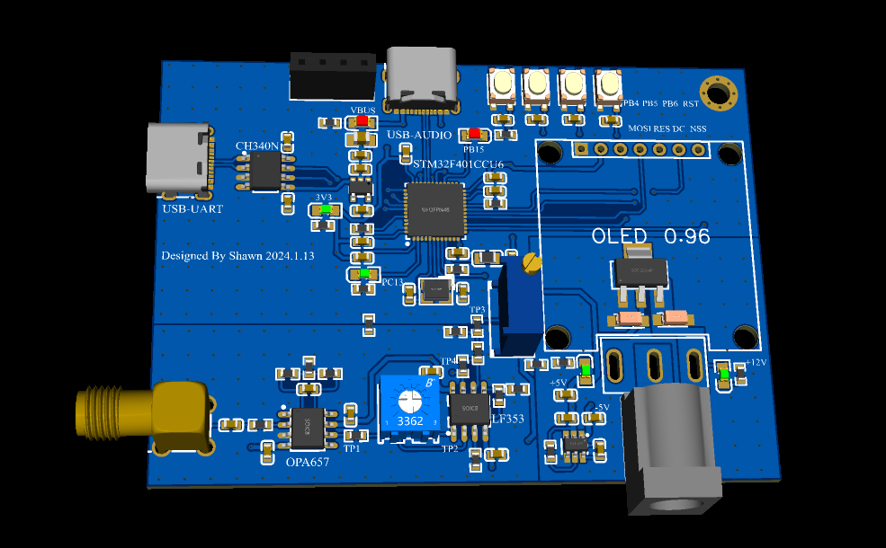
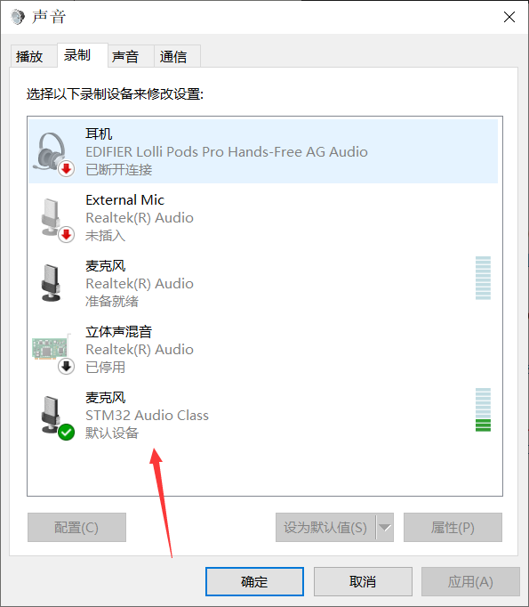
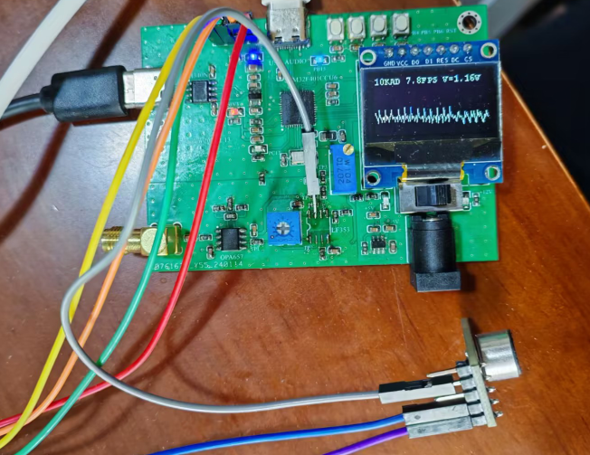
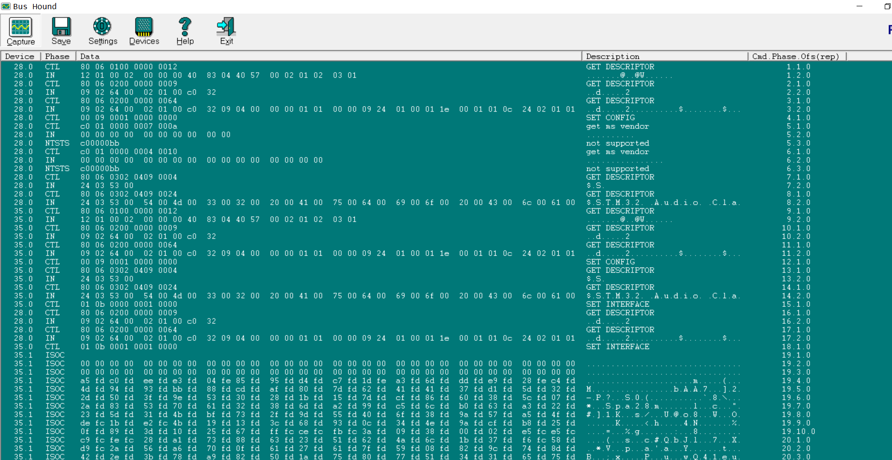
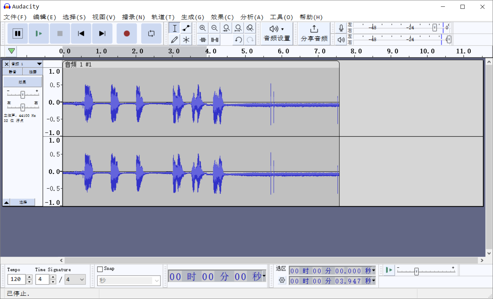
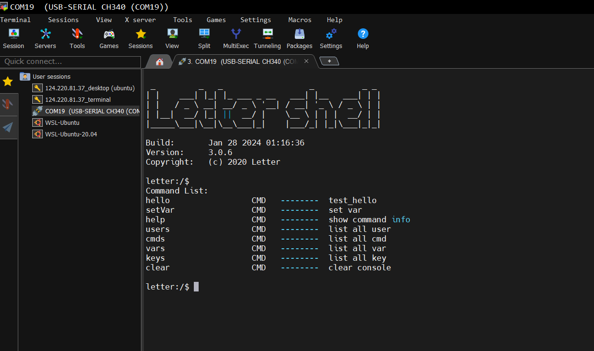
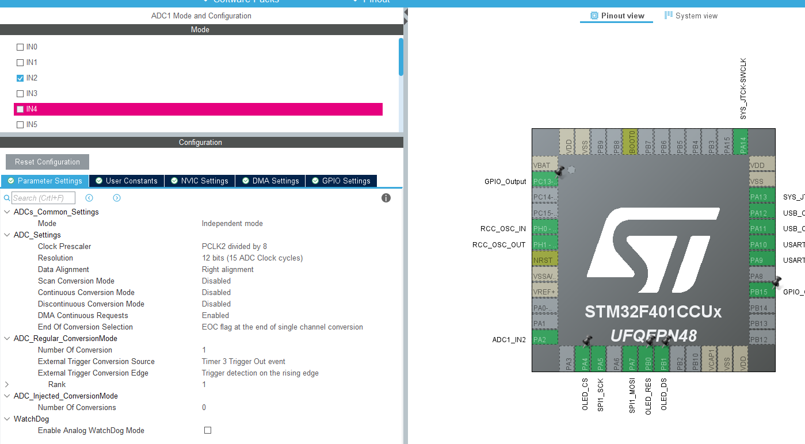
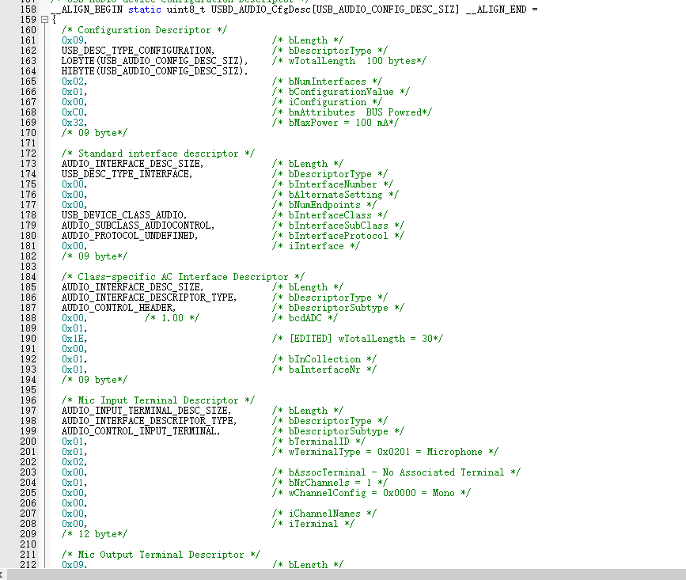
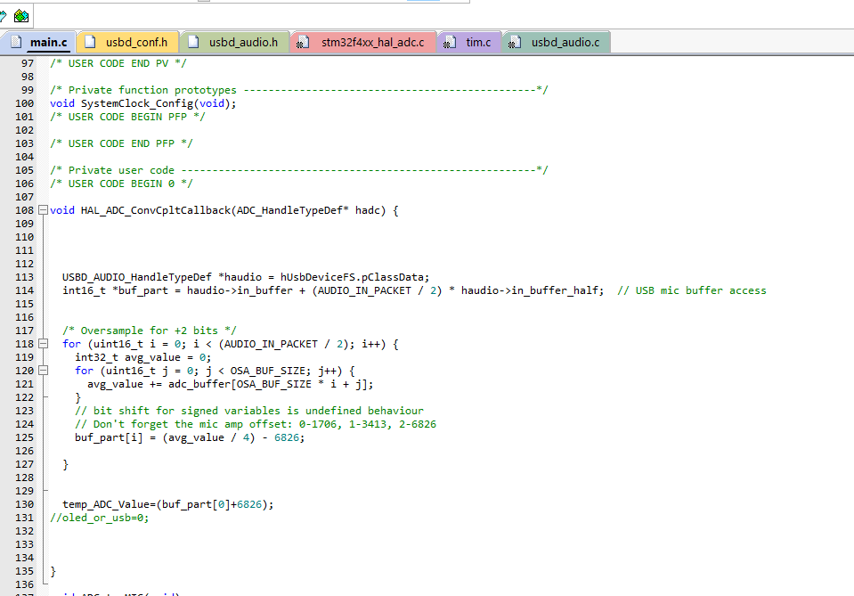

# STM32F4--AUDIO--IV-Board  V1 2024-1-29

#### 渲染图

#### 参数：

移植库：

1、OLED显示库 u8g2

[BleakyTex/STM32F4_USB_MIC: A simple USB microphone with ADC oversampling using the STM32F407 MCU and MAX9814 microphone module (github.com)](https://github.com/BleakyTex/STM32F4_USB_MIC)

2、串口 终端shell库 letter shell

[letter-shell: 项目源码-letter-shell-NevermindZZT (gitee.com)](https://gitee.com/smallqing/letter-shell)

3、音频接口  [BleakyTex/STM32F4_USB_MIC: A simple USB microphone with ADC oversampling using the STM32F407 MCU and MAX9814 microphone module (github.com)](https://github.com/BleakyTex/STM32F4_USB_MIC)

#### 功能演示

接入stm32 audio 音频设备

音频波形显示（分辨率较低）

#### 调试软件

##### USB调试软件

Bus hound

##### 音频分析软件

audacity

#### 功能说明：

串口可调试

录音触发需要点击录音软件触发

#### 软件开发注意：

ADC触发为TIM3定时触发

USB设备符

过采样算法将12位ADC分辨率转换为14位

#### 参考：

usb-uac描述符参考

[UAC 简介及版本对比 - USB中文网 (usbzh.com)](https://www.usbzh.com/article/detail-185.html)

