# ESP32-AUDIO-Board  2024-5-29

主要功能：ESP32 ADC采用之后 联网传输音频数据(freertos 双核)，PC上位机接受数据之后提供录音、音频时域、频域、语谱图分析功能

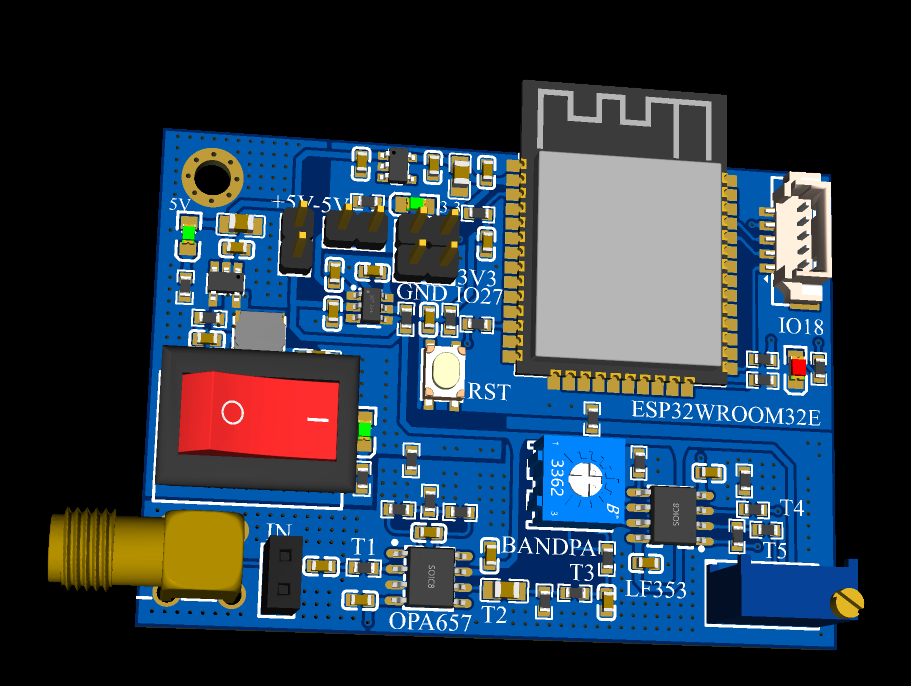

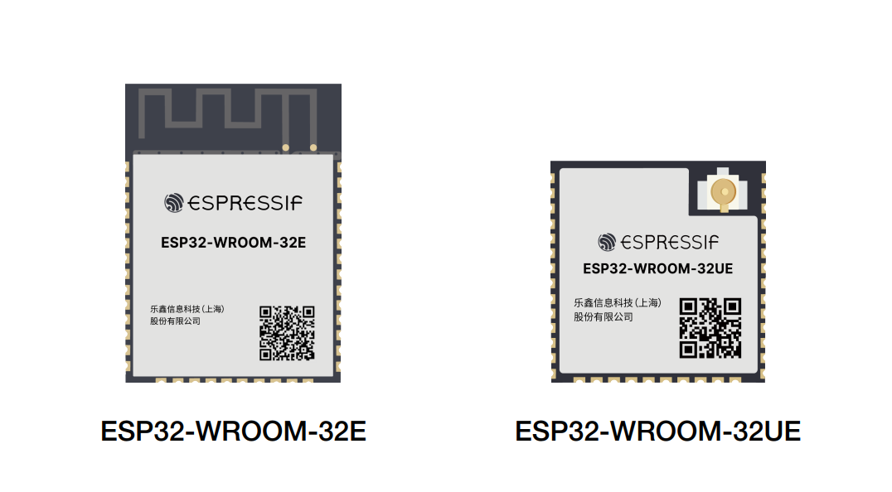

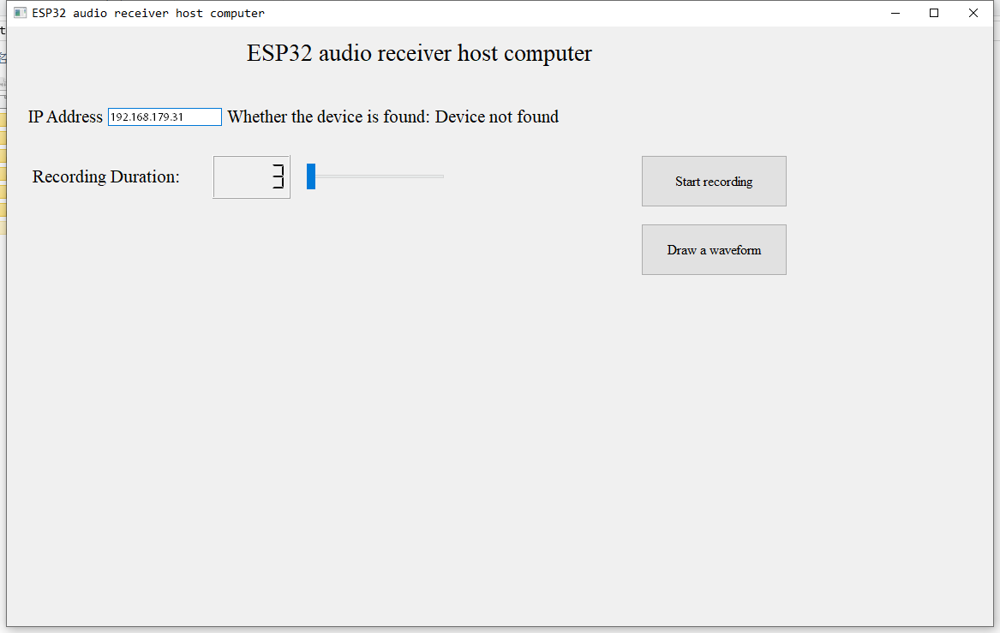

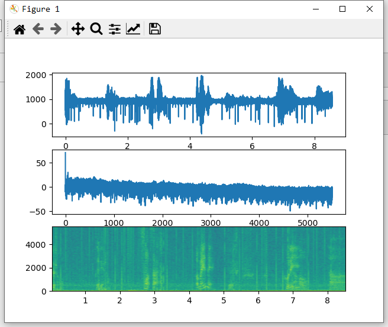

#### 1、文件夹功能

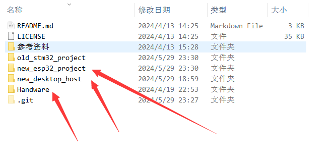

esp32_project为esp32工程文件夹，采用arduino IDE设计

desktop_host为上位机文件夹，采用python设计，主要使用pyqt5库

handware为硬件文件夹，采用立创EDA设计

#### 2、硬件设计

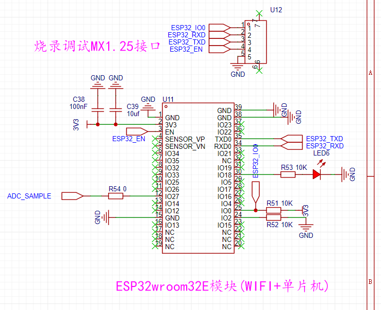


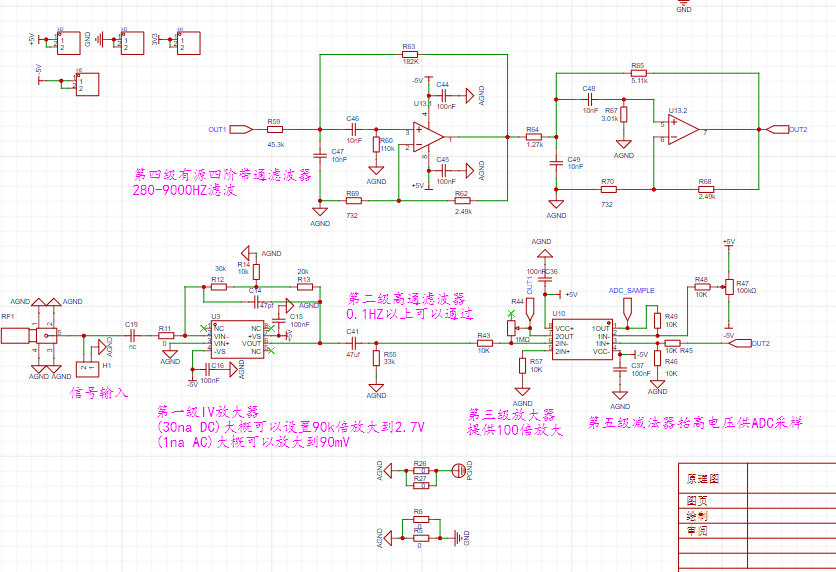

#### 3、单片机程序设计

参考[BearLaboratory/wifiaudio-tx-hardware: WiFi无线麦克风硬件pcb设计 (github.com)](https://github.com/BearLaboratory/wifiaudio-tx-hardware)

使用freertos开两个线程对应ESP32两个核心，默认连接IP地址 "192.168.179.31"，网络端口 8888

cpu1:网络连接

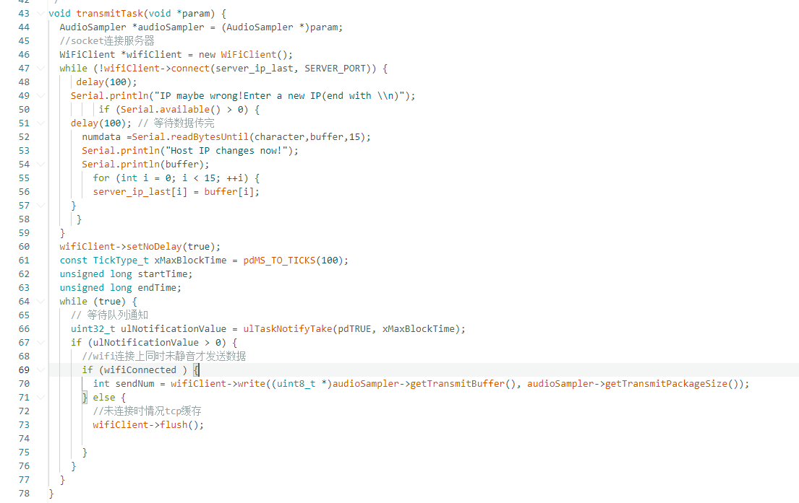

cpu0:采样

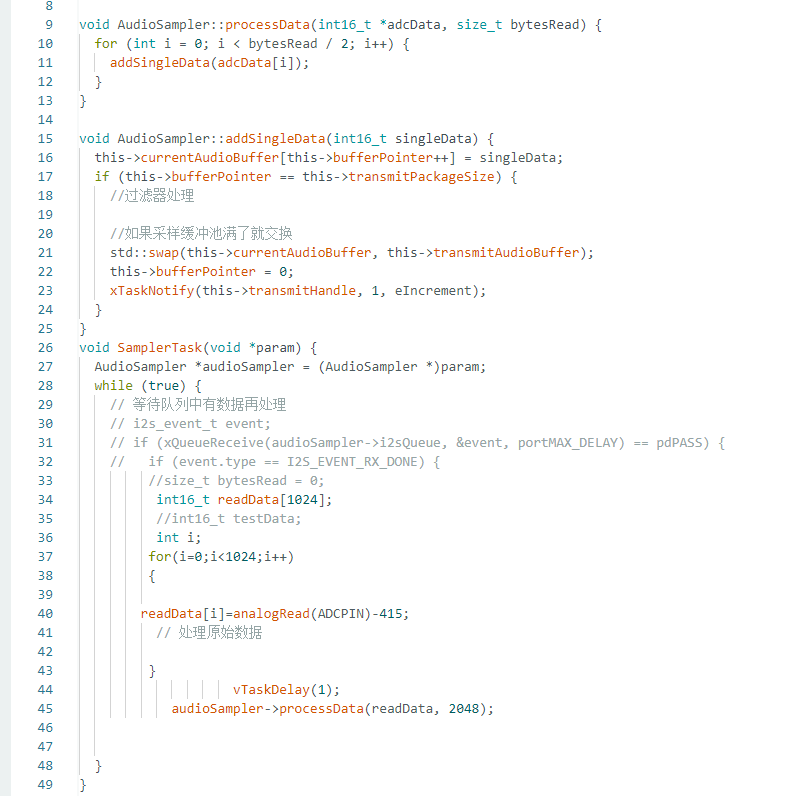

参数更改:

网络名称：

网络密码：

主机IP地址：如果连接不上可以通过串口更改IP地址，会有提示

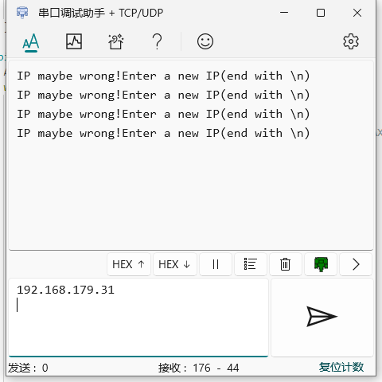

#### 4、上位机结构

使用pyqt5开发

默认获取IPv4地址，如果不对可以通过文本框更改，运用了正则表达式，不怕乱改

正常选择录音秒数之后可以开始录音，之后录音文件会出现在当前路径下，并且可以生成对应的波形图

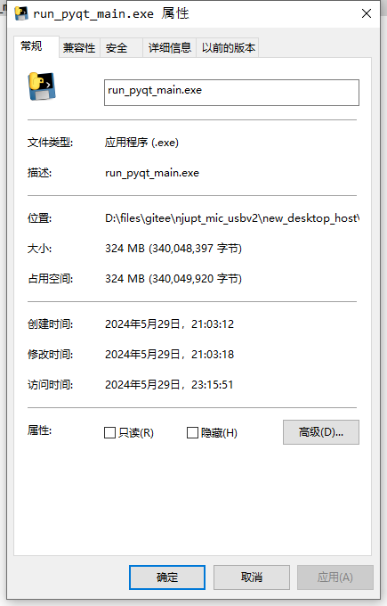

#### 5、Citation
If you get inspired by our work, or otherwise find our work valuable, please cite our paper:

```23
@article{optocoupler,
  title={Highly integrated optocoupler based on monolithic III-nitride diodes for on-chip data transfer},
  author={Fan Shi,Chengxiang Jiang,Xiao Cong,Jiaqi Yin,Jiawei Shi,Jiabin Yan,Hongbo Zhu,Yongjin Wang},
  journal={Optics & Laser Technology},
  year={2025}
}
```
